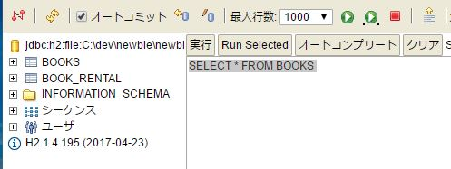

# DBを操作する

## 課題1 DBに接続する

特に設定を変えていなければ、データベースのファイルは以下に存在する
```
<Project Root>/testdb.mv.db
```

H2のサイトからzipをダウンロード  
http://www.h2database.com/html/main.html

「bin\h2.bat」を実行し、JDBCのURLを以下のように設定して接続する

```
jdbc:h2:file:<プロジェクトディレクトリのパス>\testdb
```

アプリケーションを立ち上げていると接続できないのでアプリケーションは落としておく
左側のエクスプローラーにbooksやbook_rentalが出ていることを確認する




## 課題2 本の一覧を取得する

booksを選択するとSQLのselect文が表示される。
それを実行して、2行の結果が返却されることを確認する


## 課題3 レンタルの一覧を取得する

book_rentalを選択するとSQLのselect文が表示される。

日付がvarbinary型で保存されているのはjava8対応できていないhibernateを使っているためと思われるが、アプリで使う分には実害はないのでそのままにしておくことにする
https://github.com/hibernate/hibernate-orm/wiki/Migration-Guide---5.2

## 課題4 現在レンタル中の本の一覧を取得する

booksとbook_rentalを結合して取得する

```
select b.id, b.title, b.type
from books b inner join book_rental br on b.id = br.book_entity_id
where br.returned_date is null
```

レンタル中の本を用意してから検索しないと検証できないので注意。


## 課題5 それぞれの本がレンタルされた回数を取得する

これも課題4同様に結合したあとにgroup by で集計する  

```
select title, count(*) from (
  select b.title as title
  from books b inner join book_rental br on b.id = br.book_entity_id
) group by title
```

## 課題6 どんなタイプの本が人気か調べる

考えてみよう